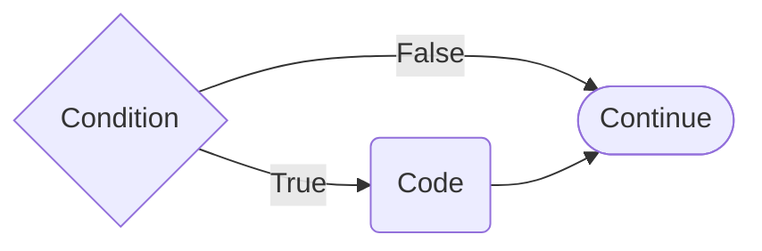
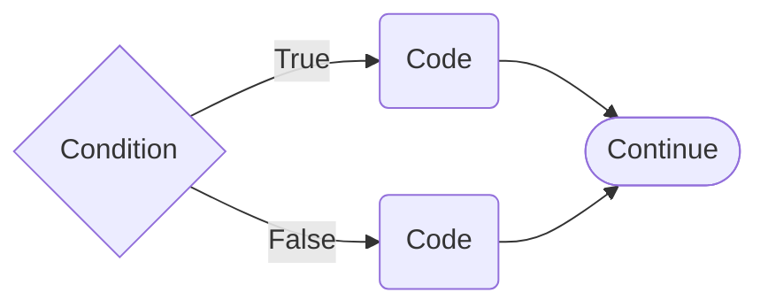
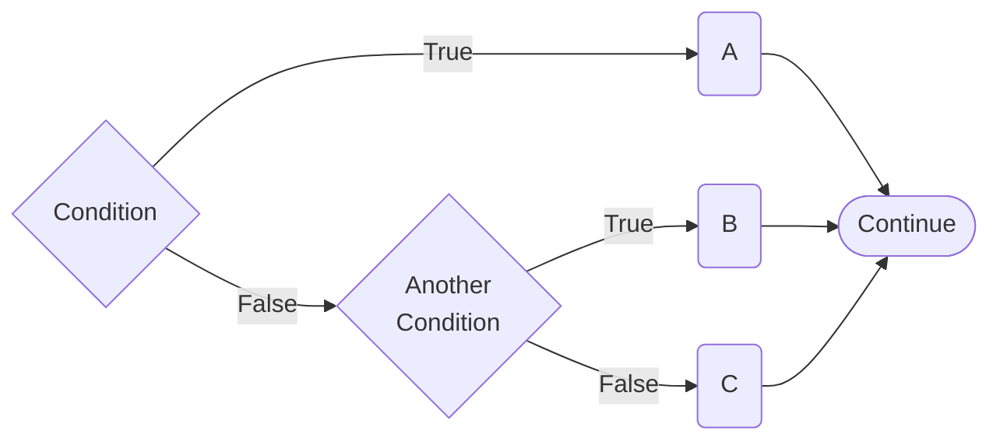

:::::::::::::::::::::::::::::::::::::: questions 

- How do I use loops to repeat code in Python?
- What are the different types of loops in Python and when should I use each one?
- What are the main logical operators in Python and how do they work?


::::::::::::::::::::::::::::::::::::::::::::::::

::::::::::::::::::::::::::::::::::::: objectives

- Learn the different types of loops in Python and when to use each one
- Understand and use the main logical operators in Python

::::::::::::::::::::::::::::::::::::::::::::::::

## Scaling Up with Loops

One of the most common and fun things to do in Python is to write loops of code. 
Loops make Python iterate over a certain section of code (usually over a list or a set of numbers). 
There are two main types of loops, the `for` loop and the `while` loop.

### `for` the Record

The `for` statement in Python iterates over the items of a sequence (e.g., a list, a string, or range of values) in the order that the items appear in the sequence. 
The syntax of a `for` loop is

```python
letters = ["a", "b", "c"]
for letter in letters:
    # Code to execute for each item in the sequence
    print(letter)
```

The body of a "for" loop is separated from the rest of the code using indentation. 
Indentation is Python's way of grouping statements, which is typically done by using either tabs or spaces (I used four spaces). 
The use of either tabs or spaces is down to personal preference, but you need to be consistent or you will get errors in your code. 
In actual English, you can think of the line `for letter in letters:` as meaning

> "For every letter in `letters`, print the letter".

You should have a file called `loops_01.py` in the `scripts` directory that contains the code,

```python
# loops_01.py

# create a list to loop over
loop_list = ['cat', 'dog', 'hamster', 'bird']

# use a "for" loop to loop over our list
# print out each entry "i" in "loop_list"
for i in loop_list:
    print(i)

```

Try running the code in `loops_01.py` and see what happens.

:::::::::::::::::::::::::::::::::::::: spoiler 

```output
cat
dog
hamster
bird
```

::::::::::::::::::::::::::::::::::::::::::::::::

This type of loop can also be used to iterate over a range of values, which is extremely helpful for indexing and slicing in a loop. 
To iterate over a range of values, you can use the `range` function, which takes a start value, a stop value, and an optional step value,

```python
range(start, stop, step)
```

Just like with indexing, the start value is inclusive while the stop value is exclusive.

To see how this works in practice, open the file `loops_02.py` in the `scripts` directory and take a look at the code.

Run the code in `loops_02.py` and see what happens.

:::::::::::::::::::::::::::::::::::::: spoiler 

```output
Example 2.1: range(0, 10, 1)
0
1
2
3
4
5
6
7
8
9
 
Example 2.2: range(0, 10, 2)
0
2
4
6
8
 
Example 2.3: range(4)
0
1
2
3
 
Example 2.4: range(length of x)
O
L
C
F
 
Example 2.5: enumerate(x)
0 O
1 L
2 C
3 F
```

::::::::::::::::::::::::::::::::::::::::::::::::

### `while` We're Here...

In contrast with `for` loops, `while` loops keep iterating until a certain condition is no longer true. The syntax of a `while` loop is

```python
while some_condition:
    # Code to execute while the condition is true
    print("This code will keep running until some_condition is no longer true.")
```

In natural English, you can think of the line `while some_condition:` as meaning

> While some condition is true, Python will execute the code in the "while" block.

Because the `while` loop constantly checks to see if a certain statement is "true", the loop is often used with comparison operators. 
The standard comparison operators are: `<` (less than), `>` (greater than), == (equal to), <= (less than or equal to), >= (greater than or equal to) and != (not equal to). 

This means

```python
# will never stop
while True:
    print("This loop will run forever!")
```

and

```python
# will never start
while False:
    print("This loop will never run!")
```

To see how this works in practice, open the file `loops_03.py` in the `scripts` directory and take a look at the code.

Run the code in `loops_03.py` and see what happens.

:::::::::::::::::::::::::::::::::::::: spoiler 

```output
Example 6.5: while x < y
x equals 0
x equals 1
x equals 2
x equals 3
x equals 4
 
Example 6.6: while z != 6
Am I 6 yet? Nope, I am 0
Am I 6 yet? Nope, I am 1
Am I 6 yet? Nope, I am 2
Am I 6 yet? Nope, I am 3
Am I 6 yet? Nope, I am 4
Am I 6 yet? Nope, I am 5
```

::::::::::::::::::::::::::::::::::::::::::::::::

`while` loops can be dangerous at times, as it is very easy to accidentally get stuck in an infinite loop if it is not coded properly. 
In the above examples, if we did not modify either `x` or `z` in our loops, their value never would have changed and we would have gotten stuck in the loop (as both conditions would always remain `True`). 
In general, if you can convert a `while` loop into a `for` loop, it is recommended to use the `for` loop version instead.

:::::::::::::::::::::::::::::::::::::: discussion 

The preference for `for` over `while` goes beyond just avoiding infinite loops.
`while` loops almost always require mutation of a variable (e.g., `x` or `z` in the above examples), which is a common source of bugs in code.
`for` loops, on the other hand, can often be written without mutation, which makes them easier to reason about and less prone to bugs. 
Finally, `for` loops without mutation are immediately equivalent to functional programming constructs like `map` and `filter`, which are often objectively better in almost every aspect.

::::::::::::::::::::::::::::::::::::::::::::::::

:::::::::::::::::::::::::::::::::::::: caution

If you do get stuck in a loop, either close the the terminal window, or press <kbd>CTRL</kbd> + <kbd>C</kbd> to interrupt the execution.

::::::::::::::::::::::::::::::::::::::::::::::::

Now that we've introduced conditions being either "True" or "False" in the context of loops, the natural next step is to introduce how to control the flow of your code based on "True" or "False" conditions.

## Fork in the Code

If you want to execute a piece of code only if a specific condition is met, the if statement comes in handy. 
For example, maybe you only want to print something out if a specific variable is "True", or when a math expression yields a specific value. 
No matter the reason, the syntax of the if statement is

```python
if condition:
    print("Execute this block if condition is True")
```



Like with loops, the body of an `if` statement is indented. 
In the example above, Python first evaluates `condition` to determine whether it is "True" or "False". 
Next, Python executes the body of the statement only if `condition` is "True". 
In natural English, you can think of the line `if condition:` as meaning

> If this line is `True`, Python will do the following: ...".

To see this in practice, open the file `logic_01.py` in the `scripts` directory and take a look at the code. 

Run the code in `logic_01.py` and see what happens.

:::::::::::::::::::::::::::::::::::::: spoiler 

```output
'x is 1'
```

::::::::::::::::::::::::::::::::::::::::::::::::

Recall from the [Types and Operators episode](./02_types_and_operators) that the `==` operator checks if two things are equal. 
In Example 1.1, `x` did indeed equal `1`, so the condition was "True" and Python executed the print function in the first if statement. 
In Example 1.2, `x` did NOT equal `2`, so the condition was "False" and Python did not execute the if statement. 
Because we did not tell Python what to do if the condition was "False", Python did nothing and skipped over it.

To explicitly tell Python what to do in the event that the condition is "False", you need to add an else statement, as in

```python
if condition:
    print("Execute this block if condition is True")
else:
    print("Execute this block if condition is False")
```



First, Python checks to see if the condition is "True". If the condition is "True", then Python executes the body of the `if` statement and ignores the body of the `else` statement. 
However, if Python found that the condition was "False", it would execute the body of the `else` statement instead.

To see this in practice, open the file `logic_02.py` in the `scripts` directory and take a look at the code. 

Run the code in `logic_02.py` and see what happens.

:::::::::::::::::::::::::::::::::::::: spoiler 

```output
'x is not 1'
```

::::::::::::::::::::::::::::::::::::::::::::::::

We see that Python only executed one of the print statements because of our `if` and `else` statements. 
The `x` variable was equal to `2`, so the `if` block `x == 1` condition was "False" and Python executed the `else` statement instead.

Extending things further, perhaps you want to tell Python to check for multiple conditions, instead of just one. 
In that case, you need to add an `elif` statement (short for "else-if"), as  in

```python
if condition:
    # A
    print("Execute this block if condition is True")
elif another_condition:
    # B
    print("Execute this block if another_condition is True")
else:
    # C
    print("Execute this block if condition is False")
```



First, Python checks to see if `condition` is "True". If it finds that `condition` is "True", then Python will execute the body of the `if` statement and skip the rest (regardless of the remaining conditions). 
However, if it finds that `condition` is "False", then Python then checks to see if `another_condition` is "True". 
If it finds that `another_condition` is "True", then Python will execute the body of the `elif` statement and skip the rest. 
And, if all conditions are "False", then Python will execute the `else` statement as a last resort.

Because Python skips the remaining if-elif-else code once it finds a "True" condition, only ONE of the statements will be executed across an entire if-elif-else section of code. 
Even if multiple statements are "True", it will only execute whichever one it finds first, starting from the top.

We only used one `elif` line in the above syntax example, but you can include as many `elif` statements as you like. 
However, note that you can only ever have one `if` and `else` line in a given if-elif-else block of code.

To see this in practice, open the file `logic_03.py` in the `scripts` directory and take a look at the code. 

Run the code in `logic_03.py` and see what happens.

:::::::::::::::::::::::::::::::::::::: spoiler 

```output
'x is less than 2'
```

::::::::::::::::::::::::::::::::::::::::::::::::

::::::::::::::::::::::::::::::::::::: keypoints

- `for` loops are used to iterate over a sequence of items, while `while` loops are used to repeat code until a certain condition is no longer true.
- The main logical operators in Python are `==` (equal to), `!=` (not equal to), `<` (less than), `>` (greater than), `<=` (less than or equal to), and `>=` (greater than or equal to).
- The `if` statement allows you to execute a block of code only if a specific condition is met, while the `else` statement allows you to execute a block of code if the condition is not met.
- The `elif` statement allows you to check for multiple conditions in an if-else block, and only the first "True" condition will be executed.
- Logical operators can be combined to create more complex conditions in `if` and `elif` statements.

::::::::::::::::::::::::::::::::::::::::::::::::
