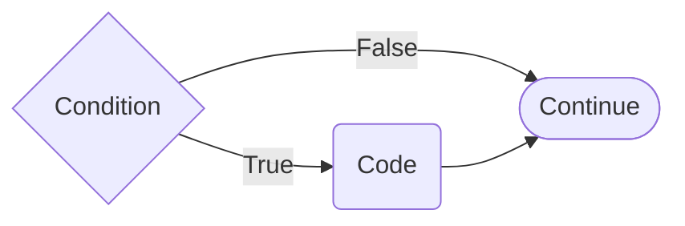
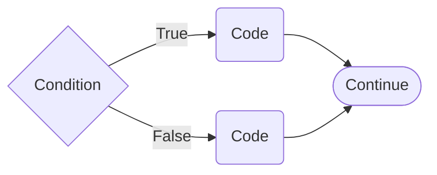
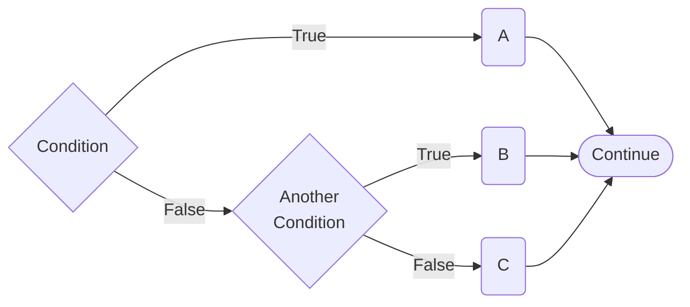

:::::::::::::::::::::::::::::::::::::: questions 

- How do you assign a value to a variable in Python?
- What are the rules for naming variables in Python?
- What are the main logical operators in Python and how do they work?


::::::::::::::::::::::::::::::::::::::::::::::::

::::::::::::::::::::::::::::::::::::: objectives

- Understand how to assign values to variables in Python
- Learn the rules for naming variables in Python
- Understand and use the main logical operators in Python

::::::::::::::::::::::::::::::::::::::::::::::::

```python
if condition:
    print("Execute this block if condition is True")
```



```python
if condition:
    print("Execute this block if condition is True")
else:
    print("Execute this block if condition is False")
```



```python
if condition:
    # A
    print("Execute this block if condition is True")
elif another_condition:
    # B
    print("Execute this block if another_condition is True")
else:
    # C
    print("Execute this block if condition is False")
```


